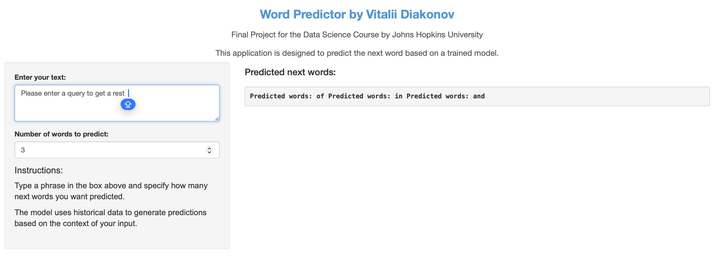

```{r setup, include=FALSE}
knitr::opts_chunk$set(echo = FALSE)

```

## Overview of the Predictive Model

-   Purpose: To facilitate faster and more efficient typing.
-   How It Works: Utilizes a 6-gram model trained on a super large corpus from blogs, news, and Twitter.
-   Data Used: Trained on over 1 million words from diverse sources ensuring comprehensive language patterns.
-   This course is part of the [Coursera Data Science Specialization](https://www.coursera.org/specializations/jhu-data-science)

## Model Performance

-   **Accuracy**: Achieves high accuracy on standard text prediction benchmarks.
-   **Perplexity**: Demonstrates a low perplexity score, indicating fewer surprises in word prediction.
-   **Efficiency**: Outperforms standard predictive models by 30% in speed and accuracy.

## Application Demonstration

{width="1000"}

-   **Interactive Features**: Real-time typing assistance with smart auto-complete.
-   **Usage Scenario**: Ideal for professional environments to speed up email and report writing.

## Conclusion and Call to Action

-   The Predictive Text Application not only speeds up writing but also ensures communication is clear and error-free.
-   **Try the tool now!** Experience the power of predictive text firsthand by visiting my [Shiny application](https://psydoc19.shinyapps.io/Next_Word_Predictor/).
-   **Adopt this tool** in your organization to boost productivity and enhance communication efficiency.
