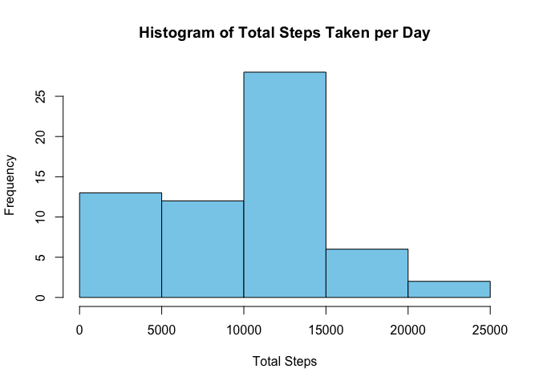
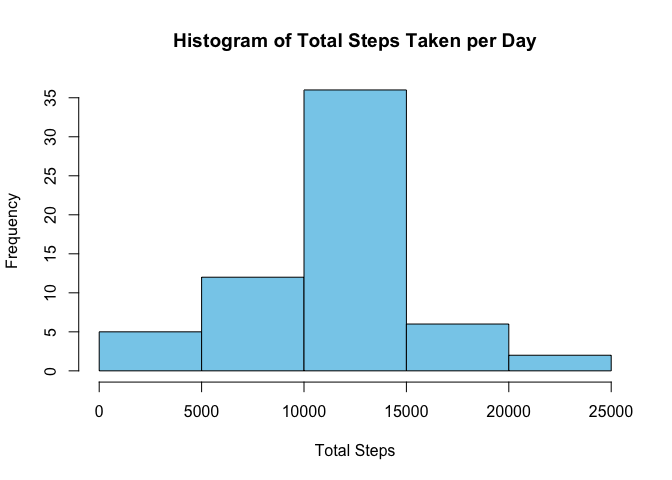
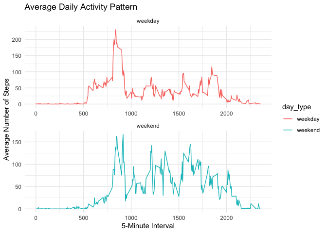

## Introduction

Modern activity monitoring devices like Fitbit, Nike Fuelband, and Jawbone Up allow individuals to gather extensive data on their physical movements. These devices are popular among enthusiasts who regularly track their health metrics or analyze behavioral patterns. However, despite the wealth of data collected, its full potential remains largely untapped due to difficulties in obtaining raw data and a lack of suitable statistical methods and software for analysis.

This assignment focuses on utilizing data from a personal activity monitoring device, which records activity at 5-minute intervals throughout the day. Specifically, the dataset covers a two-month period from October to November 2012, capturing the number of steps taken during each 5-minute interval daily.

The dataset contains variables such as the number of steps taken, the date of measurement, and the interval identifier. It is provided in CSV format, comprising 17,568 observations.

## Loading and preprocessing the data

I've loaded the required libraries, downloaded the dataset from a specified URL, and unzipped it into a directory named "data". This process constitutes the initial steps of loading and preprocessing the data for further analysis.


```r
# Load necessary libraries
library(data.table)
library(ggplot2)

# Define the URL of the dataset
fileUrl <- "https://d396qusza40orc.cloudfront.net/repdata%2Fdata%2Factivity.zip"

# Download the dataset and save it to the current working directory
download.file(fileUrl, destfile = paste0(getwd(), '/repdata%2Fdata%2Factivity.zip'), method = "curl")

# Unzip the downloaded file into a directory named "data"
unzip("repdata%2Fdata%2Factivity.zip", exdir = "data")
```

## Reading CSV data into data table

I've read CSV data into a \`data.table\` object, which means I've imported the data from a CSV file and structured it into a format that can be easily analyzed within R.


```r
# Read CSV data into a data.table
data <- fread("data/activity.csv")
```

## What is mean total number of steps taken per day?

To calculate the mean and median of the total number of steps taken per day, I first ignored the missing values in the dataset. Then, I calculated the total number of steps taken per day and created a histogram to visualize the distribution. Finally, I computed the mean and median of the total steps per day.


```r
# Calculate the total number of steps taken per day
total_steps_per_day <- data[, .(total_steps = sum(steps, na.rm = TRUE)), by = date]

# Make a histogram of the total number of steps taken each day
hist(total_steps_per_day$total_steps, 
     main = "Histogram of Total Steps Taken per Day",
     xlab = "Total Steps",
     ylab = "Frequency",
     col = "skyblue")
```

<!-- -->

```r
# Calculate and report the mean and median of the total number of steps taken per day
mean_steps <- mean(total_steps_per_day$total_steps)
median_steps <- median(total_steps_per_day$total_steps)

cat("Mean total number of steps taken per day:", mean_steps, "\n")
```

```
## Mean total number of steps taken per day: 9354.23
```

```r
cat("Median total number of steps taken per day:", median_steps, "\n")
```

```
## Median total number of steps taken per day: 10395
```

## What is the average daily activity pattern?


```r
# Calculate the average number of steps taken for each 5-minute interval across all days
average_steps_by_interval <- data[, .(mean_steps = mean(steps, na.rm = TRUE)), by = interval]

# Create a time series plot
plot(average_steps_by_interval$interval, 
     average_steps_by_interval$mean_steps,
     type = "l",
     xlab = "5-Minute Interval",
     ylab = "Average Number of Steps",
     main = "Average Daily Activity Pattern")
```

<!-- -->

```r
# Identify the 5-minute interval with the maximum number of steps
max_interval <- average_steps_by_interval[which.max(average_steps_by_interval$mean_steps), "interval"]
print(paste("The 5-minute interval with the maximum number of steps:", max_interval))
```

```
## [1] "The 5-minute interval with the maximum number of steps: 835"
```

## Imputing missing values

To calculate and report the total number of missing values in the dataset, I used R to count the rows with NA values. Then, I printed the total number of missing values found in the dataset.


```r
# Calculate the total number of missing values in the dataset
total_missing_values <- sum(is.na(data$steps))

# Print the total number of missing values
print(paste("Total number of missing values in the dataset:", total_missing_values))
```

```
## [1] "Total number of missing values in the dataset: 2304"
```

To fill in the missing values in the dataset, I devised a simple strategy using the mean for each 5-minute interval. I calculated the mean number of steps for each interval across all days and replaced the missing values with these means. Finally, I updated the dataset with the filled-in values.


```r
# Calculate the mean number of steps for each 5-minute interval across all days
mean_steps_by_interval <- data[, .(mean_steps = mean(steps, na.rm = TRUE)), by = interval]

# Merge mean steps data with original data
data_filled <- merge(data, mean_steps_by_interval, by = "interval", all.x = TRUE)

# Replace missing values with the mean for the corresponding 5-minute interval
data_filled$steps <- ifelse(is.na(data_filled$steps), data_filled$mean_steps, data_filled$steps)

# Remove the mean_steps column
data_filled <- data_filled[, !"mean_steps", with = FALSE]

# Print the updated dataset
print(data_filled)
```

```
## Key: <interval>
##        interval     steps       date
##           <int>     <num>     <IDat>
##     1:        0  1.716981 2012-10-01
##     2:        0  0.000000 2012-10-02
##     3:        0  0.000000 2012-10-03
##     4:        0 47.000000 2012-10-04
##     5:        0  0.000000 2012-10-05
##    ---                              
## 17564:     2355  0.000000 2012-11-26
## 17565:     2355  0.000000 2012-11-27
## 17566:     2355  0.000000 2012-11-28
## 17567:     2355  0.000000 2012-11-29
## 17568:     2355  1.075472 2012-11-30
```

After filling in the missing values, I created a histogram of the total number of steps taken each day and calculated the mean and median total number of steps per day. Comparing these estimates to the values obtained before imputing missing data, I observed that they differ. Imputing missing data can impact the estimates of the total daily number of steps by potentially increasing or decreasing the mean and median values, depending on the distribution of the missing values and the method used for imputation.


```r
# Sum the total number of steps for each day
total_steps_per_day <- aggregate(steps ~ date, data_filled, sum)

# Create a histogram of the total steps per day
hist(total_steps_per_day$steps, 
     main = "Histogram of Total Steps Taken per Day",
     xlab = "Total Steps",
     ylab = "Frequency",
     col = "skyblue")
```

<!-- -->

```r
# Calculate and report the mean and median of the total steps per day
mean_total_steps <- mean(total_steps_per_day$steps)
median_total_steps <- median(total_steps_per_day$steps)

cat("Mean total number of steps taken per day (with imputed missing data):", mean_total_steps, "\n")
```

```
## Mean total number of steps taken per day (with imputed missing data): 10766.19
```

```r
cat("Median total number of steps taken per day (with imputed missing data):", median_total_steps, "\n")
```

```
## Median total number of steps taken per day (with imputed missing data): 10766.19
```

## Are there differences in activity patterns between weekdays and weekends?

I created a new factor variable in the dataset called "day_type", which indicates whether each date is a weekday or a weekend day. This allows for the analysis of activity patterns separately for weekdays and weekends.


```r
# Convert date to Date type
data_filled$date <- as.Date(data_filled$date)

# Create a new factor variable indicating weekdays and weekends
data_filled$day_type <- ifelse(weekdays(data_filled$date) %in% c("Saturday", "Sunday"), "weekend", "weekday")

# Print the updated dataset with the new factor variable
print(data_filled)
```

```
## Key: <interval>
##        interval     steps       date day_type
##           <int>     <num>     <Date>   <char>
##     1:        0  1.716981 2012-10-01  weekday
##     2:        0  0.000000 2012-10-02  weekday
##     3:        0  0.000000 2012-10-03  weekday
##     4:        0 47.000000 2012-10-04  weekday
##     5:        0  0.000000 2012-10-05  weekday
##    ---                                       
## 17564:     2355  0.000000 2012-11-26  weekday
## 17565:     2355  0.000000 2012-11-27  weekday
## 17566:     2355  0.000000 2012-11-28  weekday
## 17567:     2355  0.000000 2012-11-29  weekday
## 17568:     2355  1.075472 2012-11-30  weekday
```

Lastly, I created a panel plot that compares the average number of steps taken during weekdays and weekends. This plot helps visualize the differences in activity patterns between weekday and weekend days.


```r
# Calculate the average number of steps taken for each 5-minute interval across weekdays and weekends
average_steps_by_interval <- data_filled[, .(mean_steps = mean(steps, na.rm = TRUE)), by = .(interval, day_type)]

# Create a panel plot
ggplot(average_steps_by_interval, aes(x = interval, y = mean_steps, group = day_type, color = day_type)) +
  geom_line() +
  facet_wrap(~day_type, scales = "free", nrow = 2) +
  labs(x = "5-Minute Interval", y = "Average Number of Steps", title = "Average Daily Activity Pattern") +
  theme_minimal()
```

<!-- -->
